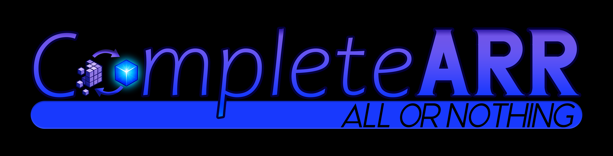
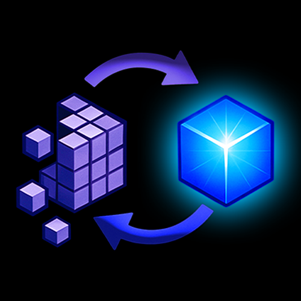

# CompleteARR - All or Nothing!

CompleteARR works as your automated media librarian, organizing films into the proper root folders and ensuring that Plex/Jellyfin/Emby only see series with every episode present.

---

## 🎪 How It Works

### 🎬 For TV Shows (Sonarr):
- **Series Engine**: Moves completed shows from "Incomplete" to "Complete" quality profile / root folder sets and monitors special episodes

### 🎥 For Movies (Radarr):
- **Film Engine**: Ensures movies stay in their correct folders based on quality profile mappings

---

## 🚀 Getting Started

### Prerequisites
- **Sonarr** (for series) and/or **Radarr** (for movies) installed and running
- **PowerShell 7.0** or newer

### Step 1: Open the Settings YMLs
Open `CompleteARR_SONARR_Settings.yml` & `CompleteARR_RADARR_Settings.yml` in the `CompleteARR_Settings` folder

### Step 2: Fill in Your API/IP/Port
After opening the _Settings.yml files, fill in the API/IP/Port information, but dont proceed any futher down the yml yet.
**Save** the updated files.

### Step 3: Run the FetchInfo Tool
**Run `CompleteARR_FetchInfo_Launcher.ps1` before doing anything else!**

This tool will:
- Connect to your Sonarr and Radarr instances
- Show you all your quality profiles and root folders
- Generate a log file (`CompleteARR_Logs/`) with all the quality profile and root folder information you need to configure your _Settings.ymls

If the FetchInfo Tool cannot connect to Sonarr or Radarr then there is something wrong with the config and CompleteARR won't work.
Go back and check your IP/Port/API

### Step 4: Configure Sets (Sonarr) & Mappings (Radarr)

#### 📺 For TV Shows (Sonarr) – Define Your “Sets”
A “Set” is a pair of **Incomplete** and **Complete** quality profiles & root folders. 
CompleteARR moves shows between them based on episode availability.

Open `CompleteARR_SONARR_Settings.yml` and fill out the `Sets:` section using the data from the FetchInfo log.

**Example configuration for someone who wants family and anime content separated from their main library can be found in the CompleteARR_SONARR_Settings.example.yml**

**Notes:**
- `Media Type:` is for logging only. Use your Plex/Jellyfin/Emby library names to stay organized.
- Your Plex/Jellyfin/Emby series libraries should **only** include the **Complete** root folders.

**Pro Tip:**
- You could add incomplete folders to an "Incomplete" Plex/Jellyfin/Emby library if you still want to be able to access your incomplete content on Plex/Jellyfin/Emby, but don't want it mixed in with your complete series.

#### 🎬 For Movies (Radarr) – Define Profile‑to‑Root Mappings
When you match a Quality Profile to a Root Folder with CompleteARR, it automatically checks that your movies are in the right root folder. If they aren’t, CompleteARR moves them for you.

Open `CompleteARR_RADARR_Settings.yml` and fill out the `FilmEngine:` section using the data from the FetchInfo log.

**Format:** 
`Quality Profile: Root Folder`

**Example configuration for someone who wants family and anime content separated from their main library can be found in the CompleteARR_SONARR_Settings.example.yml**

### Step 5: Run CompleteARR

**For Everything (Recommended):**
- Run `CompleteARR_Launch_All_Scripts.ps1`

**For Series Only:**
- Run `CompleteARR_SONARR_Launcher.ps1`

**For Movies Only:**
- Run `CompleteARR_RADARR_Launcher.ps1`

---

## 💡 Tips for Success

1. **Use the FetchInfo tool** – It makes setup much easier!
2. **Set up your Plex/Jellyfin libraries** to only include the “Complete” folders
3. **Run CompleteARR regularly** (set up a scheduled task)
4. **Check the logs** in the `CompleteARR_Logs` folder if something doesn’t work
5. **Start with dry runs** by setting `DryRun: true` in your settings
7. **Set GraceDays** to change how long an episode can be considered released, before it counts against a shows completion status.

---

## 📁 Project Structure

### 🎬 Sonarr Scripts:
- **`CompleteARR_SONARR_Launcher.ps1`** – Runs the Sonarr Series Engine
- **`CompleteARR_SONARR_SeriesEngine.ps1`** – Manages show completion and special episode monitoring

### 🎥 Radarr Scripts:
- **`CompleteARR_RADARR_Launcher.ps1`** – Runs the Radarr Film Engine
- **`CompleteARR_RADARR_FilmEngine.ps1`** – Enforces quality profile‑to‑ root folder mappings

### 🛠️ Helper Tools:
- **`CompleteARR_FetchInfo.ps1`** – Essential setup tool that shows your current Quality Profiles and Root Folders, launch with **`CompleteARR_FetchInfo_Launcher.ps1`**
- **`CompleteARR_Launch_All_Scripts.ps1`** – Runs the full suite of CompleteARR tools

### ⚙️ Configuration:
- **`CompleteARR_SONARR_Settings.yml`** – Sonarr‑specific configuration
- **`CompleteARR_RADARR_Settings.yml`** – Radarr‑specific configuration

---

## 🔒 What CompleteARR Does NOT Do

- ❌ **Does NOT download content**
- ❌ **Does NOT search for torrents or NZBs**
- ❌ **Does NOT access the internet** except to talk to your Sonarr/Radarr
- ❌ **Does NOT modify your media files**, at most it can just move them between Root Folders.

---

## ⚖️ Legal & Responsible Use

**Important:** CompleteARR is designed to help you organize media you are legally allowed to have. 
This includes:

- Media you purchased and ripped yourself, where allowed by law
- Personal recordings where allowed by law
- Content you are explicitly licensed to download or own

**You are responsible for:**
- Ensuring your setup complies with your local laws
- Respecting terms of service for any services you use
- Only using CompleteARR with content you have rights to

By using CompleteARR, you agree to use it responsibly and legally.

---

## 🆘 Need Help?

1. **Check the logs** in the `CompleteARR_Logs` folder
2. **Review your settings files** – make sure everything matches your Sonarr/Radarr setup. Refer to the Settings.example.yml
3. **Use the FetchInfo tool** to verify your configuration
4. **Start with dry runs** by setting `DryRun: true` in your settings
5. **Verify your quality profiles and root folders** match what’s in your Sonarr/Radarr settings

---

Thank you so much for using CompleteARR!

CompleteARR started off as a feature I wanted, and became its own little suite of tools, 
the first of which are included in this release with more to come in the near future. 

These tools are free and will always be free. 

If these tools have been helpful and you’d like to leave a tip,
please use the sponsor links on the main CompleteARR page.
Support is always appreciated, but never expected.
